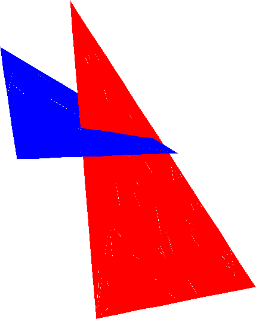

# surrender



**Don't use this.**

Render triangles with [Futhark](http://futhark-lang.org/) (install this
first).  Run something like this (requires SDL2 and SDL2-ttf headers):

```
futhark pkg sync && make && ./lys
```

This works by being parallel in the number of triangles.  Contrast to
raycasting which is parallel in the number of pixels.  We use the
`reduce_by_index` Futhark construct.

A few workarounds are needed to make this work in a regular-arrays
setting.  For instance, we need to have each triangle take up the same
amount of space in the output of its rendering computation, i.e., its
pixels and their indexes into the global frame.  We solve this by
letting the user of our library pass a size along with the triangles; we
then check that all triangle renders can fit into this size.  If this is
not the case, we forcefully split the offending triangles into smaller
sizes, and repeat the check.  Do this until everything checks out.  This
is not terribly efficient; maybe there's a better way?

TODO (if someone finds this interesting):

  * Support passing a camera position to the scene.
  * Implement a simple lighting system.
  * Let triangles consist of more than just colors (textures, shaders).
  * Add an interactive interface.
  * Fix some of the perspective stuff.
  * Try to fix some of the aliasing stuff (or whatever it is; z-fighting?). 
  * Make measurements.
